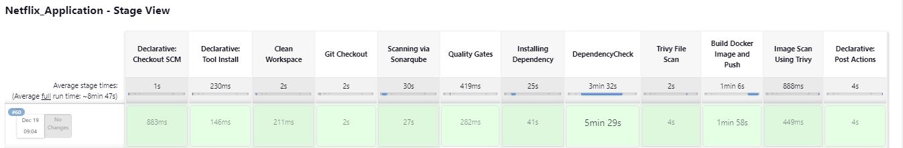
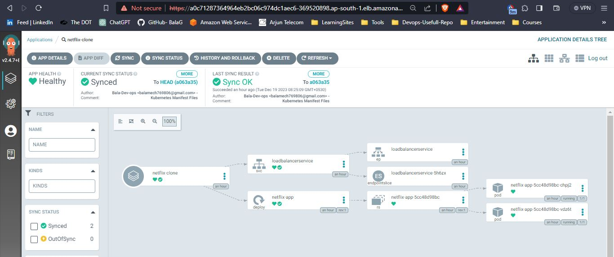
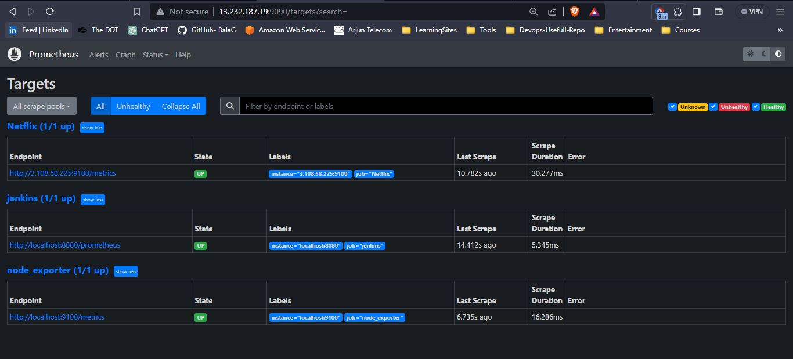
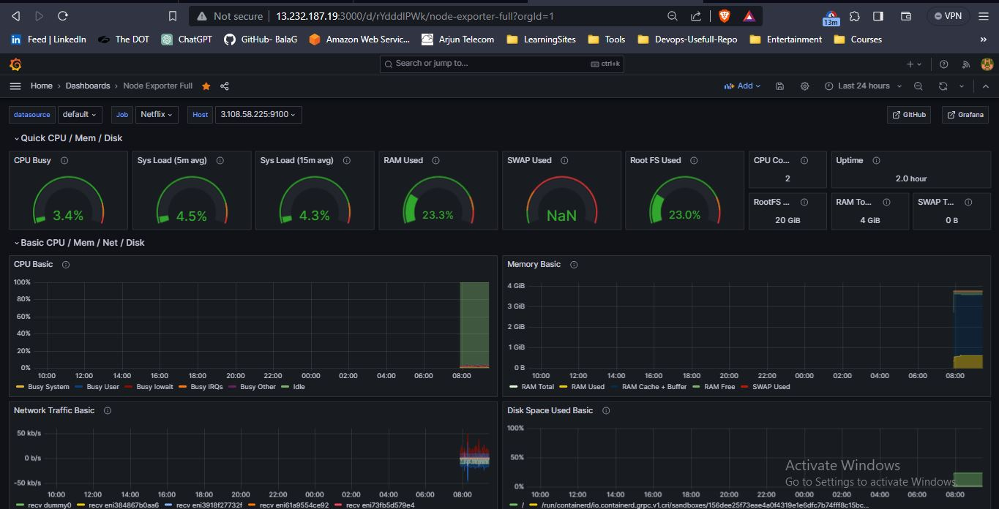
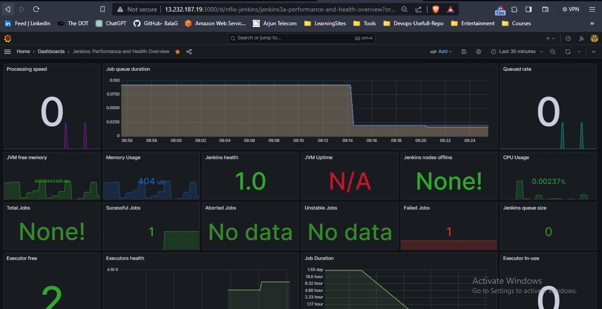
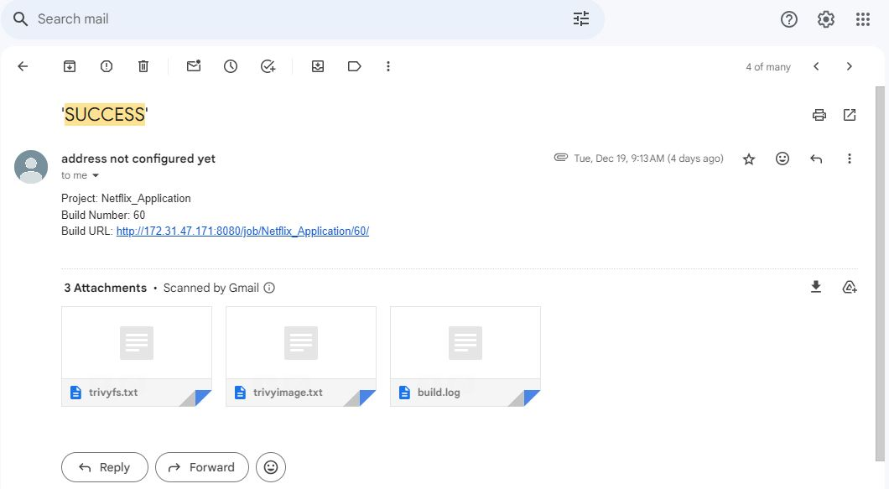

# DevSecOps Project: Deploying Netflix Clone using Jenkins & Argo CD

## Overview

This project showcases a DevSecOps approach to deploying a Netflix Clone using Jenkins for Continuous Integration (CI) and Argo CD for Continuous Deployment (CD). The pipeline ensures security at every stage, from code analysis to container image scanning.

## Project Structure

- **CI Pipeline (Jenkins):**
  - Git checkout
  - SonarQube analysis for static code analysis
  - Dependency installation
  - OWASP Dependency Check for vulnerability scanning
  - Docker image build and push to Docker Hub
  - Trivy scans for filesystem and Docker image

- **CD Deployment (Argo CD):**
  - EKS cluster deployment
  - Argo CD installation using Helm
  - Netflix Clone application deployment

    
- **Monitoring:**
  - Prometheus and Grafana setup for monitoring infrastructure health and performance.

## Security Measures

- **Static Code Analysis:**
  - Leveraging SonarQube for identifying and addressing code quality issues.

- **Dependency Scanning:**
  - Utilizing OWASP Dependency Check to identify vulnerabilities in project dependencies.

- **Container Security:**
  - Trivy scans for both the filesystem and Docker images to ensure container security.

## Deployment Infrastructure

- **EKS Cluster:**
  - Kubernetes-based deployment on Amazon EKS for scalability and reliability.

- **Argo CD:**
  - Handling Continuous Deployment with Argo CD, managing the application deployment on the EKS cluster.

## Monitoring Setup with Prometheus and Grafana

This project includes monitoring capabilities using Prometheus and Grafana:

### Prometheus Overview

Prometheus, an integral part of our monitoring setup, collects and stores various metrics from the EKS cluster nodes and Jenkins server. These metrics provide insights into the health and performance of the infrastructure.

1. **EKS Node Exporter:**
   - Collects metrics from EKS cluster nodes.
   - Target: `<eks-node-ip>:9100`

2. **Server Node Exporter:**
   - Gathers metrics from the Jenkins server.
   - Target: `<jenkins-server-ip>:9100`

3. **Jenkins Prometheus Exporter:**
   - Captures Jenkins-specific metrics.
   - Target: `<jenkins-server-ip>:8080/prometheus`

### Grafana Dashboards

Grafana visually presents Prometheus data, allowing you to monitor and analyze system performance with ease.

## Getting Started

### 1. **CI Pipeline:**
   - Set up Jenkins with necessary plugins.
   - Configure pipeline stages and secrets.

### 2. **CD Deployment:**
   - Provision an EKS cluster on AWS.
   - Install Argo CD on the cluster using Helm.

### 3. **Run the Pipeline:**
   - Trigger the Jenkins pipeline to build, test, and push the Docker image.

### 4. **Deploy with Argo CD:**
   - Use Argo CD to deploy the Netflix Clone application on the EKS cluster.

## Jenkins Pipeline

### Stages

1. **Clean Workspace:**
   - Deletes the workspace to start with a clean environment.

2. **Git Checkout:**
   - Checks out the code from the main branch of the GitHub repository.

3. **Scanning via SonarQube:**
   - Analyzes the code using SonarQube for static code analysis.

4. **Quality Gates:**
   - Waits for the SonarQube Quality Gate to pass.

5. **Installing Dependency:**
   - Installs project dependencies using npm.

6. **DependencyCheck:**
   - Scans dependencies for known vulnerabilities using DependencyCheck.

7. **Trivy File System Scan:**
   - Performs a Trivy scan on the file system to identify vulnerabilities.

8. **Build Docker Image and Push:**
   - Builds the Docker image with necessary configurations and pushes it to Docker Hub.
   - _Note: The Docker stage has a commented line related to API key. Uncomment and replace `<yourapikey>` with your actual API key when needed.Ensure to follow best practices for handling sensitive information and credentials._

9. **Image Scan Using Trivy:**
   - Performs a Trivy scan on the Docker image to identify vulnerabilities.

## Notifications

- Automated email notifications are configured to provide success/failure feedback.
- Email attachments include Trivy outputs for image and filesystem scans and build logs.
- _Note: The notification stage has a commented line for the recipient's email address. Uncomment and replace `<email-id>` with a valid email ID where you want to receive notifications._

<!-- ## Further Documentation -->

<!-- - For a more detailed walkthrough and additional insights, check out the accompanying Medium blog post:

[Deploying Netflix Clone with Jenkins & Argo CD - Medium Blog](https://your-medium-blog-url)

- Explore the full documentation on our [Wiki](https://github.com/your-username/your-repo/wiki). -->

<!-- **Note:** Blog posts will be attached for a comprehensive understanding of the project. Stay tuned! -->
