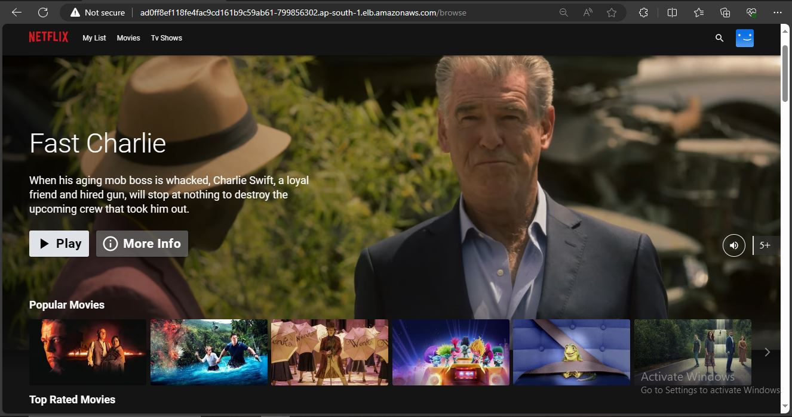

# DevSecOps Project: Deploying Netflix Clone using Jenkins & Argo CD

## Overview

This project showcases a DevSecOps approach to deploying a Netflix Clone using Jenkins for Continuous Integration (CI) and Argo CD for Continuous Deployment (CD). The pipeline ensures security at every stage, from code analysis to container image scanning.

## Project Structure

- **CI Pipeline (Jenkins):**
  - Git checkout
  - SonarQube analysis for static code analysis
  - Dependency installation
  - OWASP Dependency Check for vulnerability scanning
  - Docker image build and push to Docker Hub
  - Trivy scans for filesystem and Docker image

- **CD Deployment (Argo CD):**
  - EKS cluster deployment
  - Argo CD installation using Helm
  - Netflix Clone application deployment

## Security Measures

- **Static Code Analysis:**
  - Leveraging SonarQube for identifying and addressing code quality issues.

- **Dependency Scanning:**
  - Utilizing OWASP Dependency Check to identify vulnerabilities in project dependencies.

- **Container Security:**
  - Trivy scans for both the filesystem and Docker images to ensure container security.

## Deployment Infrastructure

- **EKS Cluster:**
  - Kubernetes-based deployment on Amazon EKS for scalability and reliability.

- **Argo CD:**
  - Handling Continuous Deployment with Argo CD, managing the application deployment on the EKS cluster.

## Getting Started

### 1. **CI Pipeline:**
   - Set up Jenkins with necessary plugins.
   - Configure pipeline stages and secrets.

### 2. **CD Deployment:**
   - Provision an EKS cluster on AWS.
   - Install Argo CD on the cluster using Helm.

### 3. **Run the Pipeline:**
   - Trigger the Jenkins pipeline to build, test, and push the Docker image.

### 4. **Deploy with Argo CD:**
   - Use Argo CD to deploy the Netflix Clone application on the EKS cluster.

## Notifications

- Automated email notifications are configured to provide success/failure feedback.
- Email attachments include Trivy outputs for image and filesystem scans and dependency check results.

<!-- ## Further Documentation -->

<!-- - For a more detailed walkthrough and additional insights, check out the accompanying Medium blog post:

[Deploying Netflix Clone with Jenkins & Argo CD - Medium Blog](https://your-medium-blog-url)

- Explore the full documentation on our [Wiki](https://github.com/your-username/your-repo/wiki). -->

<!-- **Note:** Blog posts will be attached for a comprehensive understanding of the project. Stay tuned! -->
